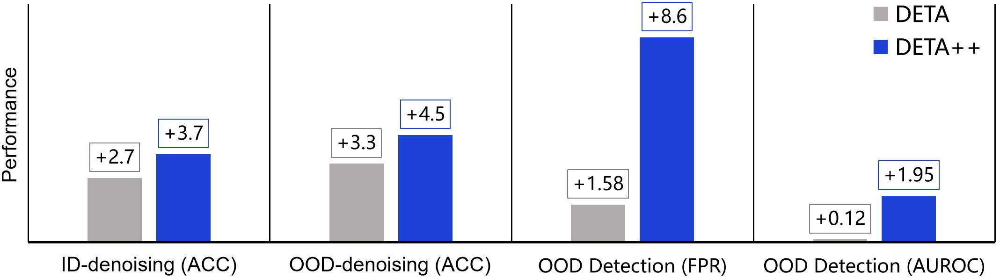

## Reliable Few-shot Learning under Dual Noises
- Authors: Ji Zhang, Jingkuan Song, Lianli Gao, Nicu Sebe, and Heng Tao Shen
- A preliminary version of this work has been published in ICCV 2023 ([DETA](https://openaccess.thecvf.com/content/ICCV2023/html/Zhang_DETA_Denoised_Task_Adaptation_for_Few-Shot_Learning_ICCV_2023_paper.html)).
  
## Abstract
Recent advances in model pre-training give rise to task adaptation-based few-shot learning (FSL), where the goal is to adapt a pre-trained task-agnostic model for capturing task-specific knowledge with a few-labeled support samples of the target task. Nevertheless, existing approaches may still fail in the open world due to the inevitable in-distribution (ID) and out-of-distribution (OOD) noise from both support and query samples of the target task. With limited support samples available, i) the adverse effect of the dual noises can be severely amplified during task adaptation, and ii) the adapted model can produce unreliable predictions on query samples in the presence of the dual noises. In this work, we propose DEnoised Task Adaptation (DETA++) for reliable FSL. DETA++ uses a Contrastive Relevance Aggregation (CoRA) module to calculate image and region weights for support samples, based on which a clean prototype loss and a noise entropy maximization loss are proposed to achieve noise-robust task adaptation. Additionally, DETA++ employs a memory bank to store and refine clean regions for each inner-task class, based on which a Local Nearest Centroid Classifier (LocalNCC) is devised to yield noise-robust predictions on query samples. Moreover, DETA++ utilizes an Intra-class Region Swapping (IntraSwap) strategy to rectify ID class prototypes during task adaptation, enhancing the model’s robustness to the dual noises. Extensive experiments demonstrate DETA++’s effectiveness and flexibility.


## Motivation

<p align="center">
  
</p>

**Two types of noises that can appear in both the support and query samples of open-world few-shot tasks.** 
- **ID Noise**: indistribution (ID) samples whose object features are obscured due to background clutter, image corruption, and etc.
- **OOD Noise**: out-ofdistribution (OOD) samples, i.e., samples from unseen classes.
 
## Overview
<p align="center">
  
</p>

**An overview of the proposed Denoised Task Adaptation (DETA++) framework.** 
**Firstly**, the images together with a set of randomly cropped local regions of support samples are fed into a pre-trained model (w/ or w/o a model-specific adapter) to extract image and region representations. **Secondly**, a contrastive relevance aggregation (CoRA) module takes the region representations as input to determine the weight of each region, based on which we can compute the image weights and refine the clean regions in a memory bank. 
**Thirdly**, a clean prototype loss and a noise entropy maximization loss are devised in a weighted embedding space to improve the noise-robustness of the adapted model.  **Fourthly**, we employ a memory bank to store clean regions for each class, based on which an Intra-class Region Swapping (IntraSwap) strategy is developed to rectify the class prototypes of ID classes and a Local Nearest Centroid Classifier (LocalNCC) is proposed to yield noise-robust predictions on query samples.

## Contributions
- We reveal that the overlooked ID and OOD noise in few-shot tasks negatively affect the task adaptation performance of existing FSL methods. To tackle this, we propose a first, unified, ID- and OOD-denoising
framework DETA++.

- The proposed DETA++ framework is orthogonal to task adaptation based few-shot classification and OOD detection approaches, therefore can be used as
a plugin to improve their performance.

- Extensive experiments demonstrate the strong performance and flexibility of DETA++, outperforming competitive baselines that specialize in either fewshot classification or OOD detection.

## Strong Performance and Flexibility
- **Image-denoising on vanilla Meta-dataset (w/o OOD noises)**
<p align="center">
  
</p>

- **Label-denoising on OOD-polluted Meta-dataset**
<p align="center">
  
</p>

- **State-of-the-art Comparison (Few-shot Classification)**
<p align="center">
  
</p>

- **State-of-the-art Comparison (Few-shot OOD Detection)**
<p align="center">
  
</p>

## Visualization
- **Visualization of the cropped regions and calculated weights by CoRA**
<p align="center">
  
</p>

## DETA++ vs. DETA 
- **Performance gains of DETA++ and DETA over baseline models**
<p align="center">
  
</p>


## Dependencies
* Python 3.6 or greater
* PyTorch 1.0 or greater
* TensorFlow 1.14 or greater

## Datasets
* Clone or download this repository.
* Follow the "User instructions" in the [Meta-Dataset repository](https://github.com/google-research/meta-dataset) for "Installation" and "Downloading and converting datasets".
* Edit ```./meta-dataset/data/reader.py``` in the meta-dataset repository to change ```dataset = dataset.batch(batch_size, drop_remainder=False)``` to ```dataset = dataset.batch(batch_size, drop_remainder=True)```. (The code can run with ```drop_remainder=False```, but in our work, we drop the remainder such that we will not use very small batch for some domains and we recommend to drop the remainder for reproducing our methods.)

## Pretrained Models
- [URL (RN-18)](https://github.com/VICO-UoE/URL)

- [DINO (ViT-S)](https://github.com/facebookresearch/dino)

- [MoCo-v2 (RN-50)](https://github.com/facebookresearch/moco)

- [CLIP (RN-50)](https://github.com/OpenAI/CLIP)

- [Deit (ViT-S)](https://github.com/facebookresearch/deit)

- [Swin Transformer (Tiny)](https://github.com/microsoft/Swin-Transformer)

## Initialization
* Before doing anything, first run the following commands.
    ```
    ulimit -n 50000
    export META_DATASET_ROOT=<root directory of the cloned or downloaded Meta-Dataset repository>
    export RECORDS=<the directory where tf-records of MetaDataset are stored>
    ```
* Enter the root directory of this project, i.e. the directory where this project was cloned or downloaded.


## Task Adaptation
**Specify a pretrained model to be adapted, and execute the following command**.
* Baseline
    ```
    python main.py --pretrained_model=MOCO --maxIt=40 --ratio=0.3 --test.type=10shot
    ```
* Ours
    ```
    python main.py --pretrained_model=MOCO --maxIt=40 --ratio=0.3 --test.type=10shot --ours
    ```
 **Note:** set ratio=0. for ID-denoising, set  0. < ratio < 1.0 for OOD-denoising.


## References
<div style="text-align:justify; font-size:80%">
    <p>
        [1] Eleni Triantafillou, Tyler Zhu, Vincent Dumoulin, Pascal Lamblin, Utku Evci, Kelvin Xu, Ross Goroshin, Carles Gelada, Kevin Swersky, Pierre-Antoine Manzagol, Hugo Larochelle; <a href="https://arxiv.org/abs/1903.03096">Meta-Dataset: A Dataset of Datasets for Learning to Learn from Few Examples</a>; ICLR 2020.
    </p>
    <p>
        [2] Li, Wei-Hong and Liu, Xialei and Bilen, Hakan; <a href="https://arxiv.org/abs/2107.00358">Cross-domain Few-shot Learning with Task-specific Adapters</a>; CVPR 2022.
    </p>
    <p>
        [3] Xu, Chengming and Yang, Siqian and Wang, Yabiao and Wang, Zhanxiong and Fu, Yanwei and Xue, Xiangyang; <a href="https://openreview.net/pdf?id=n3qLz4eL1l">Exploring Efficient Few-shot Adaptation for Vision Transformers</a>; Transactions on Machine Learning Research 2022.
    </p>
    <p>
        [4] Liang, Kevin J and Rangrej, Samrudhdhi B and Petrovic, Vladan and Hassner, Tal; <a href="https://openaccess.thecvf.com/content/CVPR2022/papers/Liang_Few-Shot_Learning_With_Noisy_Labels_CVPR_2022_paper.pdf">Few-shot learning with noisy labels</a>; CVPR 2022.
    </p>
    <p>
        [5] Chen, Pengguang, Shu Liu, and Jiaya Jia; <a href="http://openaccess.thecvf.com/content/CVPR2021/papers/Chen_Jigsaw_Clustering_for_Unsupervised_Visual_Representation_Learning_CVPR_2021_paper.pdf">Jigsaw clustering for unsupervised visual representation learning</a>; CVPR 2020.
    </p>
      <p>
    [6] Zhang Ji, Gao Lianli, Luo Xu, Shen Heng Tao and Song Jinagkuan; <a href="https://openaccess.thecvf.com/content/ICCV2023/html/Zhang_DETA_Denoised_Task_Adaptation_for_Few-Shot_Learning_ICCV_2023_paper.html">DETA: Denoised Task Adaptation for Few-shot Learning</a>; ICCV 2023.
    </p>
    

</div>


## Acknowledge
We thank authors of [Meta-Dataset](https://github.com/google-research/meta-dataset), [URL/TSA](https://github.com/VICO-UoE/URL), [eTT](https://github.com/loadder/eTT_TMLR2022), [JigsawClustering](https://github.com/dvlab-research/JigsawClustering) for their source code. 


## Contact
If you hava any questions, feel free to

* Contact me at: jizhang.jim@gmail.com
* New an issue in this repo.


